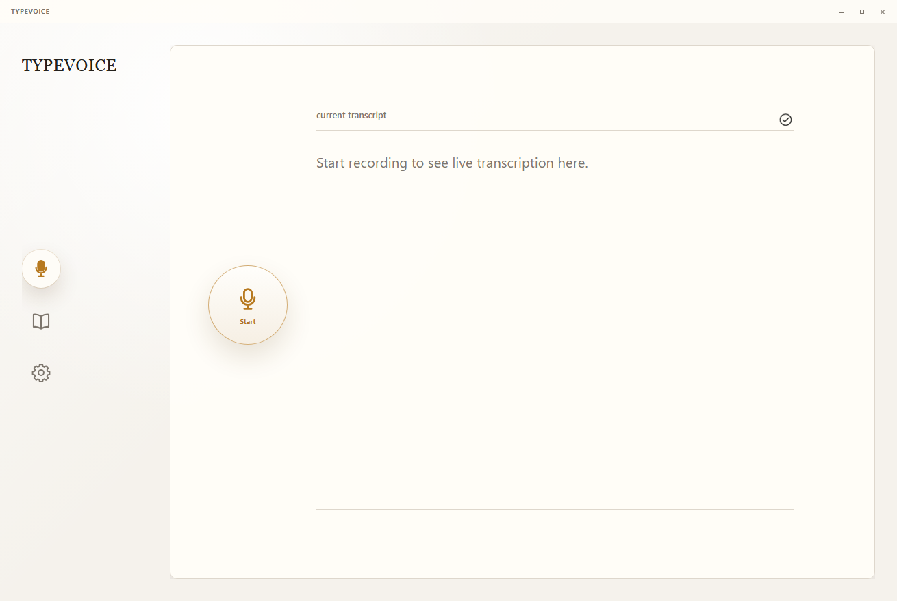

# TypeVoice

<p><small>Speak. Don't type.</small></p>

[](#安装)
[](https://github.com/JiaJunDeng5930/TypeVoice/releases)
[](./LICENSE)

TypeVoice 是一款语音输入法：说话输入中文，自动转写成文本，并用 LLM 做智能改写、纠错和润色，最后复制或自动粘贴到当前输入框。



录音、转写、改写、复制和自动粘贴都在主界面完成。

## 它能做什么

- 说话生成中文文本。
- ASR 转写后交给 LLM 智能改写和纠错。
- 支持一键复制和自动粘贴。
- 保留历史文本与任务信息。
- 支持 Doubao 流式 ASR 和远程 HTTP ASR。

## 安装

### Windows 安装包

1. 打开 [GitHub Releases](https://github.com/JiaJunDeng5930/TypeVoice/releases)。
2. 下载最新 release 里的 Windows 安装包，文件扩展名为 `.exe` 或 `.msi`。
3. 运行安装包。
4. 启动 TypeVoice。

### 从源码打包安装包

在 Windows PowerShell 中执行：

```powershell
git clone https://github.com/JiaJunDeng5930/TypeVoice.git
cd TypeVoice
cargo xtask toolchain ffmpeg --platform all
cd apps\desktop
npm ci
npm run package
```

安装包输出目录：

```text
target/release/bundle/
```

打包完成后，打开该目录，运行里面生成的 `.exe` 或 `.msi` 安装包。

## 第一次配置

1. 启动 TypeVoice，点击左侧齿轮图标进入 Settings。
2. 在 `Speech recognition` 里选择 ASR Provider：
   - `doubao streaming`：填写 `App Key` 和 `Access Key`，点击 `Save key`，再点击 `Check key`。
   - `remote (cloud)`：填写 `remote ASR URL`、可选 `remote model name`、`remote slicing concurrency` 和 Remote ASR key，点击 `Save key`，再点击 `Check key`。
3. 在 `Language model` 里填写 `API Base URL` 和 `Model`，选择 reasoning 档位，点击 `Save`。
4. 在 `API key` 里填写 LLM API key，点击 `Save`，再点击 `Check`。
5. 在 `Rewrite` 里开启 rewrite，填写 LLM prompt，点击 `Save`。
6. 在 `Export` 里按需开启 `auto paste`，点击 `Save`。

## 使用方式

1. 点击主界面的 `Start`。
2. 说话。
3. 再次点击主按钮结束录音。
4. 等待 ASR 转写和 LLM 改写。
5. 检查最终文本。
6. 使用复制结果，或让 TypeVoice 自动粘贴到当前输入框。

## 开发运行

从仓库根目录启动最新源码：

```powershell
cd TypeVoice
cargo xtask run latest
```

直接运行 Tauri 开发模式：

```powershell
cd TypeVoice\apps\desktop
npm run tauri dev
```

## 隐私

- ASR Provider 会接收录音音频。
- LLM 只接收转写文本与启用的上下文。
- 历史记录保存文本与元信息。
- API Key 使用系统安全存储。

详细说明见 [docs/privacy-data-flow.md](./docs/privacy-data-flow.md)。

## 验证与发布维护

Windows 一键门禁：

```powershell
cd TypeVoice
cargo xtask gate windows
```

常用验证命令：

```powershell
cd TypeVoice
cargo test --locked -p xtask
cargo xtask verify quick
cargo xtask verify full
```

发布流程见 [docs/release-process.md](./docs/release-process.md)，Windows gate 见 [docs/windows-gate.md](./docs/windows-gate.md)。

## 支持与文档

- Bug 和需求：<https://github.com/JiaJunDeng5930/TypeVoice/issues>
- 支持边界：[SUPPORT.md](./SUPPORT.md)
- 安全问题：[SECURITY.md](./SECURITY.md)
- 文档索引：[docs/index.md](./docs/index.md)
- 基础规格：[docs/base-spec.md](./docs/base-spec.md)
- 技术规格：[docs/tech-spec.md](./docs/tech-spec.md)

## 许可证与第三方声明

- 本项目许可证：[LICENSE](./LICENSE)
- 第三方组件声明：[THIRD_PARTY_NOTICES.md](./THIRD_PARTY_NOTICES.md)
